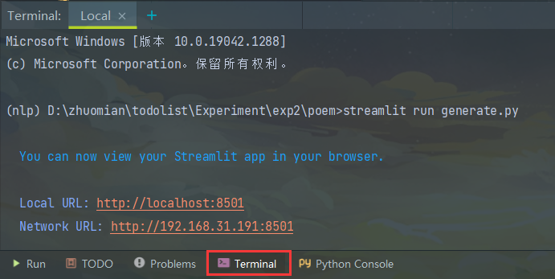
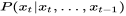

**自然语言处理工程报告**

目录：

[实验一、语料库的收集与整理](#实验一语料库的收集与整理)

[一、研究背景](#一研究背景)

[二、模型方法](#二模型方法)

[三、系统设计](#三系统设计)

[四、系统演示与分析](#四系统演示与分析)

[实验二、词汇知识库使用技术](#实验二词汇知识库使用技术)

[一、研究背景](#一研究背景-1)

[二、模型方法](#二模型方法-1)

[三、系统设计](#三系统设计-1)

[四、系统演示与分析](#四系统演示与分析-1)

[实验三、中文分词技术应用](#实验三中文分词技术应用)

[一、研究背景](#一研究背景-2)

[二、模型方法](#二模型方法-2)

[三、系统设计](#三系统设计-2)

[四、系统演示与分析](#四系统演示与分析-2)

[实验四、文本分类技术应用](#实验四文本分类技术应用)

[一、研究背景](#一研究背景-3)

[二、模型方法](#二模型方法-3)

[三、系统设计](#三系统设计-3)

[3.1语料预处理](#语料预处理)

[3.2生成训练集和测试集](#生成训练集和测试集)

[3.3文本特征提取:TF-IDF](#文本特征提取tf-idf)

[3.4构建分类器](#构建分类器)

[3.5分类器的评估](#分类器的评估)

[四、系统演示与分析](#四系统演示与分析-3)

[实验五、自动问答系统搭建](#实验五自动问答系统搭建)

[一、研究背景](#一研究背景-4)

[二、模型方法](#二模型方法-4)

[三、系统设计](#三系统设计-4)

[3.1 数据预处理](#数据预处理)

[3.2 生成batch的训练数据](#生成batch的训练数据)

[3.3 训练Seq2Seq模型](#训练seq2seq模型)

[3.4可视化前端](#可视化前端)

[四、系统演示与分析](#四系统演示与分析-4)

[对本门课的感想、意见和建议](#对本门课的感想意见和建议)

[附：对于实验演示（可视化）系统线上部署的尝试：](#附对于实验演示可视化系统线上部署的尝试)

[1、在云服务器端安装docker](#在云服务器端安装docker)

[2拉取python镜像](#拉取python镜像)

[3创建python容器](#创建python容器)

[3.1、首先创建网段](#首先创建网段)

[3.2、在创建的网段范围内创建python容器](#在创建的网段范围内创建python容器)

[4、启动服务streamlit服务](#启动服务streamlit服务)

[5 在浏览器访问](#在浏览器访问)

# 实验一、语料库的收集与整理

实验目的：

1.理解词频统计的概念

2.理解Ngram文法的概念

3.掌握从文本中统计生成词典的技术

4.了解文本不同的编码方式

实验内容：

1.熟悉开发环境（可采用Python，C/C++或者Java）

2.根据文本的编码方式，编写词频统计程序

实验步骤：

二，系统设计

1.打开开发环境，根据自己熟悉的语言，确定开发环境。

2.下载语料库（ci.txt和新闻语料库）到特定目录下，或从https://github.com/chinese-poetry/chinese-poetry中下载。

3.根据文本编码，加载语料库文本

4.分别统计n-gram（n=1，2）的词频，存储到相应的数据结构，该数据结构包括词（词本身）和词的频度（出现次数）

5.将内存中的数据结构存储到文本中，方便后面随时加载。

## 一、研究背景

n元语法（英语：n-gram）指文本中连续出现的n个语词。n元语法模型是基于(n-1)阶[马尔可夫链](https://zh.wikipedia.org/wiki/%E9%A9%AC%E5%B0%94%E5%8F%AF%E5%A4%AB%E9%93%BE)的一种概率[语言模型](https://zh.wikipedia.org/wiki/%E8%AF%AD%E8%A8%80%E6%A8%A1%E5%9E%8B)，通过n个语词出现的概率来推断语句的结构。[\[1\]](https://zh.wikipedia.org/wiki/N%E5%85%83%E8%AF%AD%E6%B3%95#cite_note-1)[\[2\]](https://zh.wikipedia.org/wiki/N%E5%85%83%E8%AF%AD%E6%B3%95#cite_note-naer-2)这一模型被广泛应用于[概率论](https://zh.wikipedia.org/wiki/%E6%A6%82%E7%8E%87%E8%AE%BA)、通信理论、[计算语言学](https://zh.wikipedia.org/wiki/%E8%AE%A1%E7%AE%97%E8%AF%AD%E8%A8%80%E5%AD%A6)（如基于统计的[自然语言处理](https://zh.wikipedia.org/wiki/%E8%87%AA%E7%84%B6%E8%AF%AD%E8%A8%80%E5%A4%84%E7%90%86)）、[计算生物学](https://zh.wikipedia.org/wiki/%E8%AE%A1%E7%AE%97%E7%94%9F%E7%89%A9%E5%AD%A6)（如[序列分析](https://zh.wikipedia.org/wiki/%E5%BA%8F%E5%88%97%E5%88%86%E6%9E%90)）、[数据压缩](https://zh.wikipedia.org/wiki/%E6%95%B0%E6%8D%AE%E5%8E%8B%E7%BC%A9)等领域。当n分别为1、2、3时，又分别称为一元语法（unigram）、[二元语法](https://zh.wikipedia.org/wiki/%E4%BA%8C%E5%85%83%E8%AF%AD%E6%B3%95)（bigram）与三元语法（trigram）

N-Gram是大词汇连续语音识别中常用的一种语言模型，对中文而言，我们称之为汉语语言模型(CLM,
Chinese Language
Model)。汉语语言模型利用上下文中相邻词间的搭配信息，在需要把连续无空格的拼音、笔划，或代表字母或笔划的数字，转换成汉字串(即句子)时，可以计算出具有最大概率的句子，从而实现到汉字的自动转换，无需用户手动选择，避开了许多汉字对应一个相同的拼音(或笔划串，或数字串)的重码问题。

## 二、模型方法

N-Gram是一种基于统计语言模型的算法。它的基本思想是将文本里面的内容按照字节进行大小为N的滑动窗口操作，形成了长度是N的字节片段序列。

每一个字节片段称为gram，对所有gram的出现频度进行统计，并且按照事先设定好的阈值进行过滤，形成关键gram列表，也就是这个文本的向量特征空间，列表中的每一种gram就是一个特征向量维度。

该模型基于这样一种假设，第N个词的出现只与前面N-1个词相关，而与其它任何词都不相关，整句的概率就是各个词出现概率的乘积。这些概率可以通过直接从语料中统计N个词同时出现的次数得到。常用的是二元的Bi-Gram和三元的Tri-Gram。

## 三、系统设计

1、使用的语料库：ci.txt

2、如果单个的分词含有"非中文"，则跳过（re.findall返回的是一个列表，"列表为空"在if语句中即代表false；正则表达式匹配的是\"非中文\"）

{width="4.5in" height="5.121527777777778in"}

3、举例：

（绿色代表被筛选出来的（字段中全部是中文），红色代表被舍弃的（字段中含有其他字符））


## 四、系统演示与分析

生成的文本文档部分内容


# 实验二、词汇知识库使用技术

实验目的：

1.理解词典的概念

2.理解文本生成的概念

3.掌握从词典中生成文本内容的技术

实验内容：

1.熟悉开发环境（可采用Python，C/C++或者Java）

2.根据词典中的词和词频，随机生成文本内容，或采取优化方案生成流畅的文本内容。

实验步骤：

二，系统设计

1.打开开发环境，根据自己熟悉的语言，确定开发环境。

2.将实验一中生成的词典到特定目录下

3.将词典加载到内存中，主要包括词和词频

4.采用随机生成，或者n-gram等算法，生成文本序列

5.构建前端，演示文本生成。其中包括，根据宋词词典，自动生成宋词，根据人民日报的词典，自动生成文本内容。

## 一、研究背景

自然语言生成（NLG）是[自然语言处理](https://zh.wikipedia.org/wiki/%E8%87%AA%E7%84%B6%E8%AA%9E%E8%A8%80%E8%99%95%E7%90%86)的一部分，从[知识库](https://zh.wikipedia.org/wiki/%E7%9F%A5%E8%AD%98%E5%BA%AB)或[逻辑形式](https://zh.wikipedia.org/w/index.php?title=%E9%82%8F%E8%BC%AF%E5%BD%A2%E5%BC%8F&action=edit&redlink=1)等等机器表述系统去生成[自然语言](https://zh.wikipedia.org/wiki/%E8%87%AA%E7%84%B6%E8%AA%9E%E8%A8%80)。这种形式表述当作心理表述的模型时，[心理语言学家](https://zh.wikipedia.org/wiki/%E5%BF%83%E7%90%86%E8%AA%9E%E8%A8%80%E5%AD%B8)会选用[语言产出](https://zh.wikipedia.org/w/index.php?title=%E8%AA%9E%E8%A8%80%E7%94%A2%E5%87%BA&action=edit&redlink=1)这个术语。

自然语言生成系统可以说是一种将资料转换成自然语言表述的翻译器。不过产生最终语言的方法不同于编译程式，因为自然语言多样的表达。NLG出现已久，但是商业NLG技术直到最近才变得普及。

自然语言生成可以视为[自然语言理解](https://zh.wikipedia.org/wiki/%E8%87%AA%E7%84%B6%E8%AA%9E%E8%A8%80%E7%90%86%E8%A7%A3)的反向：
自然语言理解系统须要厘清输入句的意涵，从而产生机器表述语言；自然语言生成系统须要决定如何把概念转化成语言。

一个简单的例子是套用信函的生成系统。这种系统通常没有运用文法的知识，但是可以生成信函给消费者，例如告诉消费者信用卡的额度已达。换言之，简单的系统运用版型，跟Word文件的邮件合并程式没什么差别，但是更复杂的NLG系统会灵活地产生文本。

正如[自然语言处理](https://zh.wikipedia.org/wiki/%E8%87%AA%E7%84%B6%E8%AA%9E%E8%A8%80%E8%99%95%E7%90%86)的其它领域，自然语言生成可以使用明确的语言模型（例如文法）或者运用根据真人所写的文本分析而成的统计模型。

自然语言生成是研究使计算机具有人一样的表达和写作的功能。即能够根据一些关键信息及其在机器内部的表达形式，经过一个规划过程，来自动生成一段高质量的自然语言文本。自然语言处理包括自然语言理解和自然语言生成。自然语言生成是人工智能和[计算语言学](https://baike.baidu.com/item/%E8%AE%A1%E7%AE%97%E8%AF%AD%E8%A8%80%E5%AD%A6/1036659)的分支,相应的语言生成系统是基于语言信息处理的计算机模型,其工作过程与自然语言分析相反,是从抽象的概念层次开始,通过选择并执行一定的语义和语法规则来生成文本。

## 二、模型方法

N-Gram是一种基于统计语言模型的算法。它的基本思想是将文本里面的内容按照字节进行大小为N的滑动窗口操作，形成了长度是N的字节片段序列。

每一个字节片段称为gram，对所有gram的出现频度进行统计，并且按照事先设定好的阈值进行过滤，形成关键gram列表，也就是这个文本的向量特征空间，列表中的每一种gram就是一个特征向量维度。

该模型基于这样一种假设，第N个词的出现只与前面N-1个词相关，而与其它任何词都不相关，整句的概率就是各个词出现概率的乘积。这些概率可以通过直接从语料中统计N个词同时出现的次数得到。常用的是二元的Bi-Gram和三元的Tri-Gram。

## 三、系统设计

1、自动生成宋词


部分debug截图：


2、自动生成文本内容


部分debug截图：


## 四、系统演示与分析

运行：在Terminal中输入：streamlit run generate.py




# 实验三、中文分词技术应用

实验目的：

1.理解中文分词的基本概念

2.掌握2-3种中文分词算法

3.掌握从文本中统计生成词典的技术

4.了解文本不同的编码方式

实验内容：

1.熟悉开发环境（可采用Python，C/C++或者Java）

2.根据文本的编码方式，编写词频统计程序

实验步骤：

二，系统设计

1.打开开发环境，根据自己熟悉的语言，确定开发环境。

2.导入相应的分词词典，如果基于模型，则导入相应的模型。

3.实现FMM和BMM，或者基于n-gram的分词方法

4.实现界面，输入一句话，输出分词结果

5.存储分词结果到文件中。

## 一、研究背景

中文分词指的是中文在基本文法上有其特殊性而存在的分词。

分词就是将连续的字序列按照一定的规范重新组合成词序列的过程。我们知道，在英文的行文中，单词之间是以空格作为自然分界符的，而中文只是字、句和段能通过明显的分界符来简单划界，唯独词没有一个形式上的分界符，虽然英文也同样存在短语的划分问题，不过在词这一层上，中文比之英文要复杂得多、困难得多。

存在中文[分词技术](https://baike.baidu.com/item/%E5%88%86%E8%AF%8D%E6%8A%80%E6%9C%AF)，是由于中文在基本文法上有其特殊性，具体表现在：

1．与英文为代表的拉丁语系语言相比，英文以空格作为天然的分隔符，而中文由于继承自古代汉语的传统，词语之间没有分隔。　古代汉语中除了连绵词和人名地名等，词通常就是单个汉字，所以当时没有分词书写的必要。而现代汉语中双字或多字词居多，一个字不再等同于一个词。

2．在中文里，"词"和"词组"边界模糊

现代汉语的基本表达单元虽然为"词"，且以双字或者多字词居多，但由于人们认识水平的不同，对词和短语的边界很难去区分。

例如："对随地吐痰者给予处罚"，"随地吐痰者"本身是一个词还是一个短语，不同的人会有不同的标准，同样的"海上""酒厂"等等，即使是同一个人也可能做出不同判断，如果汉语真的要分词书写，必然会出现混乱，难度很大。

中文分词的方法其实不局限于中文应用，也被应用到英文处理，如手写识别，单词之间的空格就不很清楚，中文分词方法可以帮助判别英文单词的边界。

## 二、模型方法

**正向最大匹配（FMM）**

从左到右尽可能划分出一段连续字符，使得其等于词典中的某个词，然后将这段连续字符提取出来，对余下的部分进行同样的操作。如果第一个字符不是词典中任何一个词的前缀，那么这个字符单独作为一个词。

**逆向最大匹配（BMM）**

跟正向最大匹配的唯一不同是从右到左尽可能划分出一段连续字符。

## 三、系统设计

先从语料库"1998-01-2003版-带音.txt"中提取统计出单字的词danci_dict、二字的词shuangci_dict、三字的词sanci_dict、四字的词sici_dict、五字的词wuci_dict，然后按照下面的流程进行分词。

**FMM**


BMM类似，只是顺序改为了从后向前。

部分debug截图：


## 四、系统演示与分析


# 实验四、文本分类技术应用

实验目的：

1.理解文本分类的概念

2.理解文本分类算法的概念

3.掌握文本特征提取和分类算法包应用技术

4.了解多标签分类与单标签分类

实验内容：

1.熟悉开发环境（可采用Python，C/C++或者Java）

2.基于Libsvm等分类算法包，实现文本分类

实验步骤：

二，系统设计

1.打开开发环境，根据自己熟悉的语言，确定开发环境。

2.下载语料库（搜狗新闻分类语料）到特定目录下

3.根据不同的文本特征提取方法，提取文本特征，实现文本向量化，即将文本转换成向量。

4.将向量转换为libsvm等算法包的格式，使用libsvm进行训练，获得模型。

5.搭建演示系统，输入一段文本，输出分类结果。

## 一、研究背景

文本分类用电脑对文本集(或其他实体或物件)按照一定的分类体系或标准进行自动分类标记。
它根据一个已经被标注的训练文档集合,
找到文档特征和文档类别之间的关系模型, 然后利用这种学习得到的关系模型对
新的文档进行类别判断。文本分类从基于知识的方法逐渐转变为基于统计和机器学习的方法。

文本分类（Text
Classification）是自然语言处理中的一个重要应用技术，根据文档的内容或主题，自动识别文档所属的预先定义的类别标签。文本分类是很多应用场景的基础，比如垃圾邮件识别，舆情分析，情感识别，新闻自动分类，智能客服机器人的知识库分类等等。它和其他的分类没有本质的区别，核心方法为首先提取分类数据的特征，然后选择最优的匹配，从而分类。但是文本也有自己的特点，根据文本的特点，文本分类的一般流程为：1.预处理；2.文本表示及特征选择；3.构造[分类器](https://www.zhihu.com/search?q=%E5%88%86%E7%B1%BB%E5%99%A8&search_source=Entity&hybrid_search_source=Entity&hybrid_search_extra=%7b)；4.分类。

## 二、模型方法

文本分类问题与其它分类问题没有本质上的区别，其方法可以归结为根据待[分类数据](https://baike.baidu.com/item/%E5%88%86%E7%B1%BB%E6%95%B0%E6%8D%AE/6248754)的某些特征来进行匹配，当然完全的匹配是不太可能的，因此必须（根据某种评价标准）选择最优的匹配结果，从而完成分类。

以下介绍几种常用的文本分类方法：

**词匹配法**：词匹配法是最早被提出的分类算法。这种方法仅根据文档中是否出现了与类名相同的词（顶多再加入同义词的处理）来判断文档是否属于某个类别。很显然，这种过于简单机械的方法无法带来良好的分类效果。

**知识工程**：后来兴起过一段时间的知识工程的方法则借助于专业人员的帮助，为每个类别定义大量的推理规则，如果一篇文档能满足这些推理规则，则可以判定属于该类别。这里与特定规则的匹配程度成为了文本的特征。由于在系统中加入了人为判断的因素，准确度比词匹配法大为提高。但这种方法的缺点仍然明显，例如分类的质量严重
依赖于这些规则的好坏，也就是依赖于制定规则的"人"的好坏；再比如制定规则的人都是专家级别，[人力成本](https://baike.baidu.com/item/%E4%BA%BA%E5%8A%9B%E6%88%90%E6%9C%AC/5141136)大幅上升常常令人难以承受；而知识工程最致命的弱点是完全不具备可推广性，一个针对金融领域构建的分类系统，如果要扩充到医疗或社会保险等相关领域，则除了完全推倒重来以外没有其他办法，常常造成巨大的
知识和资金浪费。

**统计学习**：统计学习方法需要一批由人工进行了准确分类的文档作为学习的材料（称为训练集，注意由人分类一批文档比从这些文档中总结出准确的规则成本要低得多），计算机从这些文档中挖掘出一些能够有效分类的规则，这个过程被形象的称为训练，而总结出的规则集合常常被称为[分类器](https://baike.baidu.com/item/%E5%88%86%E7%B1%BB%E5%99%A8)。训练完成之后，需要对计算机从来没有见过的文档进行分类时，便使用这些分类器来进行。

现如今，统计学习方法已经成为了文本分类领域绝对的主流。主要的原因在于其中的很多技术拥有坚实的理论基础（相比之下，[知识工程](https://baike.baidu.com/item/%E7%9F%A5%E8%AF%86%E5%B7%A5%E7%A8%8B)方法中专家的主观因素居多），存在明确的评价标准，以及实际表现良好。统计分类算法

将样本数据成功转化为向量表示之后，计算机才算开始真正意义上的"学习"过程。常用的分类算法为：**[决策树](https://baike.baidu.com/item/%E5%86%B3%E7%AD%96%E6%A0%91)，Rocchio，[朴素贝叶斯](https://baike.baidu.com/item/%E6%9C%B4%E7%B4%A0%E8%B4%9D%E5%8F%B6%E6%96%AF)，神经网络，[支持向量机](https://baike.baidu.com/item/%E6%94%AF%E6%8C%81%E5%90%91%E9%87%8F%E6%9C%BA)，线性最小平方拟合，kNN，[遗传算法](https://baike.baidu.com/item/%E9%81%97%E4%BC%A0%E7%AE%97%E6%B3%95)，最大熵，Generalized
Instance Set等。**

## 三、系统设计

本实验用标注好的搜狗新闻语料，基于scikit-learn机器学习Python库，将文本分类的完整过程实现一遍。

### 3.1语料预处理

定义搜狗新闻文本标签的名称，类似C000008这样的标签是语料的子目录，在网上搜到标签对应的新闻类别，为了便于理解，定义了这个映射词典，并保留原有编号信息。在网上搜索下载搜狗分类新闻.20061127.zip语料并解压至CN_Corpus目录下，解压之后目录结构为：


category_labels = { \'C000008\': \'\_08_Finance\', \'C000010\':
\'\_10_IT\', \'C000013\': \'\_13_Health\', \'C000014\': \'\_14_Sports\',
\'C000016\': \'\_16_Travel\', \'C000020\': \'\_20_Education\',
\'C000022\': \'\_22_Recruit\', \'C000023\': \'\_23_Culture\',
\'C000024\': \'\_24_Military\' }

下面进行语料的切分，将每个类别的前75%作为训练语料，后25%作为测试语料。切分完之后的语料目录如下：


### 3.2生成训练集和测试集

中文分词

定义一个分词预处理函数，采用jieba分词工具，主要去掉对文本分类无用的标点符号和数字，输入为新闻文本，输出为分词之后并用空格连接的文本。

生成数据集

从上面切分好的语料目录中读取文本并进行分词预处理，输出：训练语料数据(X_train_data)、训练语料标签(y_train)、测试语料数据(X_test_data)、测试语料标签(y_test)。

数据集的形式如下：

X_train_data\[1000\]

\'新华网 上海 月 日电 记者 黄庭钧 继 日 人民币 兑 美元 中间价 突破 关口
创 历史 新高 后 日 人民币 兑 美元汇率 继续 攀升 中国外汇交易中心 日 公布
的 中间价 为 再刷 历史 新高 大有 逼近 和 突破 心理 关口 之势 据 兴业银行
资金 营运 中心 交易员 余屹 介绍 人民币 兑 美元汇率 日 走势 继续 表现
强劲 竞价 交易 以 开盘 后 最低 曾 回到 最高 则 触及 距 关口 仅 一步之遥
收报 而 询价 交易 亦 表现 不俗 以 开盘 后 曾经 走低 到 最高 仅触 到 截至
时 分 报收 虽然 全日 波幅 较窄 但 均 在 下方 有 跃跃欲试 关口 之 态势
完\'

y_train\[1000\]

\'\_08_Finance\'

词云显示

这里插一个与文本分类无关的步骤，用WordCloud展示文本的词频信息，直观看一下文本关键词信息，生成的词云图片可以让人一目了然。如果让人来进行分类，扫一眼词云就可以在很短时间内做出分类判断，比阅读原始文本要快的多，其原理就是利用了文本中的高频词信息，频率高的词（去除停用词之后）比较能代表文本的主旨信息，其实后面的分类过程大概就是这个思路。WordCloud默认不显示中文字体，会显示成方块，可以在网上下载字体文件simhei.ttf，放在当前目录下即可。

### 3.3文本特征提取:TF-IDF

这个步骤将文档信息，也即每篇新闻被分好词之后的词集合，转为为基于词频-你文档词频（TF-IDF）的向量，向量的每个元素都是对应于某个词在这个文档中的TF-IDF值，在不同文档中，同一词的TF-IDF是不一样的。所有文档的TF-IDF向量堆放在一起就组成了一个TF-IDF矩阵。注意到这里应该包含了除停用词之外的所有词的TF-IDF值，词的个数构成了向量的维度。

用TfidfVectorizer将文档集合转为TF-IDF矩阵。注意到前面我们将文本做了分词并用空格隔开。如果是英文，本身就是空格隔开的，而英文的分词（Tokenizing）是包含在特征提取器中的，不需要分词这一步骤。下面我们在得到了分类器之后，使用新文本进行分类预测时，也是需要先做一下中文分词的。

### 3.4构建分类器

scikit-learn提供了一个Pipeline工具，可以将上面从特征提取到分类器的训练这些步骤串起来，以方便调用。

使用Pipeline训练分类器，这里直接使用原始数据，而不是特征提取之后的TF-IDF数据。因为特征提取包含在Pipeline中。

使用Pipeline对上述新的新闻文本进行分类：

### 3.5分类器的评估

有了分类器，以及知道了如何用分类器来对新的文本进行分类预测，那么我们可以用前面划分出来的测试集对这个分类器进行性能评估。

## 四、系统演示与分析


在Jupyter notebook上使用测试集评估分类器


混淆矩阵


# 实验五、自动问答系统搭建

## 一、研究背景

问答系统是信息检索的一种高级形式，能够更加准确地理解用户用自然语言提出的问题，并通过检索语料库、知识图谱或问答知识库返回简洁、准确的匹配答案。相较于搜索引擎，问答系统能更好地理解用户提问的真实意图,
进一步能更有效地满足用户的信息需求。问答系统是目前人工智能和自然语言处理领域中一个倍受关注并具有广泛发展前景的研究方向。

**问答系统分类**：从发展历史看来，问答系统的发展历程可以简单概括为：基于结构化数据的问答系统、基于自由文本的问答系统、基于问题答案对的问答系统三个阶段。

**基于结构化数据的问答系统：**早期由于智能技术及数据获取的局限性，问答系统主要是面向限定领域，该时期的问答系统处理的数据类型是简单且高度结构化的数据，系统一般将输入问题转化为数据库查询语句，通过数据库的检索返回答案。

**基于自由文本的问答系统：**问答系统对知识数据的组织形式要求越严格，说明需要的"人工"越多，那么系统的"智能"程度就越低。随着互联网的飞速发展以及信息检索技术的兴起，90年代问答系统进入面向开放领域，基于自由文本数据的发展时期。这种问答系统的处理流程主要包括：问题分析、文档检索及段落划分、候选答案抽取、答案排序、答案验证等。

**基于问题答案对的问答系统：**基于问题答案对的问答系统主要涉及CQA（community
question answering）与FAQ（Frequently asked
questions）两种类型。网络上出现的社区问答（community question answering,
CQA）提供了大规模的用户交互衍生的问题答案对（question-answer pair, QA
pair）数据，为基于问答对的问答系统提供了稳定可靠的问答数据来源。与CQA相比，FAQ具有限定领域、质量高、组织好等优点，使得系统回答问题的水平大大提高。但FAQ的获取成本高，这个缺点又制约了基于FAQ的问答系统的应用范围。

在诸多类型的问答系统中，旨在"负责任"地准确解决用户问题有FAQ检索型、任务型、知识图谱型以及文档型。显然，除了文档型机器人，其他类型的对话机器人都需要不同程度的数据组织，来辅助计算机理解和回答用户问题。其中，FAQ检索型需要整理问题答案对，知识图谱型需要整理知识关系网络，任务型需要任务场景和槽位的定制。从算法角度来看，知识的质量、结构化程度越高，问答系统的效果才越好，才越"智能"。但对知识的组织程度要求越高，就需要越多的"人工"，应用落地的成本则越大。

问答系统通常分为任务型机器人、闲聊机器人和解决型机器人（客服机器人），三者的设计分别针对不同的应用场景。A）：任务型机器人主要用于完成用户的某些特定任务，比如：买机票、话费充值或者天气咨询。B）：闲聊机器人主要用于深入的和用户进行无目的交流；C）：解决型机器人（客服机器人）用于解决用户的问题，比如：商品购买咨询、商品退货咨询等。

## 二、模型方法

**seq2seq**：Seq2seq将输入序列转换为输出序列。它通过利用[循环神经网络](https://zh.wikipedia.org/wiki/%E5%BE%AA%E7%8E%AF%E7%A5%9E%E7%BB%8F%E7%BD%91%E7%BB%9C)（递归神经网络）或更常用的[LSTM](https://zh.wikipedia.org/wiki/%E9%95%B7%E7%9F%AD%E6%9C%9F%E8%A8%98%E6%86%B6)[GRU](https://zh.wikipedia.org/w/index.php?title=%E9%97%A8%E7%BB%8F%E5%B8%B8%E6%80%A7%E7%9A%84%E5%8D%95%E5%85%83&action=edit&redlink=1)网络来避免[梯度消失问题](https://zh.wikipedia.org/wiki/%E6%A2%AF%E5%BA%A6%E6%B6%88%E5%A4%B1%E9%97%AE%E9%A2%98)。当前项的内容总来源于前一步的输出。Seq2seq主要由一个编码器和一个解码器组成。编码器将输入转换为一个隐藏状态向量，其中包含输入项的内容。
解码器进行相反的过程，将向量转换成输出序列，并使用前一步的输出作为下一步的输入。

优化包括：

1.注意力机制：解码器的输入只有一个单独的向量，这个向量包含输入序列的全部信息。注意力机制允许解码器有选择的分块地使用输入序列的信息。

2.束搜索，而不是选择单一的输出(文字)作为输出、多极有可能选择是保留，结构化作为一个树（使用 [Softmax](https://zh.wikipedia.org/wiki/Softmax%E5%87%BD%E6%95%B0) 上设置的注意力的分数[\[5\]](https://zh.wikipedia.org/wiki/Seq2seq#cite_note-:2-5)）。
平均编码器国家加权关注的分布。

3.存入桶:变序列长度是可能的，因为填补0，这可以做到的输入和输出。
然而，如果的序列长度为100和输入只有3项长、昂贵的空间被浪费。
桶可以不同规模和指定的输入和输出的长度。

训练通常使用通常使用[交叉熵](https://zh.wikipedia.org/wiki/%E4%BA%A4%E5%8F%89%E7%86%B5)[损失函数](https://zh.wikipedia.org/wiki/%E6%8D%9F%E5%A4%B1%E5%87%BD%E6%95%B0)

## 三、系统设计

本次系统全部使用 [Python](https://so.csdn.net/so/search?from=pc_blog_highlight&q=Python) 编写，在系统设计上遵循着配置灵活、代码模块化的思路，分为数据预处理器、训练模型、可视化展示3个模块。\
模块间的逻辑关系大致为：\
（1）数据预处理是将原始语料进行初步的处理以满足于数据处理模块的要求；\
（2）训练模型是一个基于 TF 的 seq2seq
模型，用于定义神经网络并进行模型计算；\
（3）可视化展示是一个用前端框架写的简单的人机交互程序，在运行时调用API进行人机对话。\
整体的框架图如下：


### 3.1 数据预处理

#### 3.1.1语料库

本实验是一个对话机器人实验，所以选择的语料主要是一些QA对，开放数据也很多可以下载，存放的格式是第一行为问题，第二行为回答，第三行又是问题，第四行为回答，以此类推。考虑语料数量和质量，选择小黄鸡50w分词语料库。

#### 3.1.2语料预处理


语料处理的主要流程如上图所示，在我们从网上获取到合适的语料库后开始对原始的语料库进行加工处理来满足模型训练的要求，提高训练效果。

（1）语料清洗\
在语料中找到需要的东西，把不需要的、视为噪音的内容清洗删除，包括对于原始文本提取标题、摘要、正文等信息，对于爬取的网页内容，去除标签、HTML、JS
等代码和注释等。由于语料本身实现大部分清洗功能，所以只需要在进行分词，去除停用词等处理。\
（2）分词\
中文语料数据为一批短文本或者长文本，比如：句子，文章摘要，段落或者整篇文章组成的一个集合。一般句子、段落之间的字、词语是连续的，有一定含义。而进行文本挖掘分析时，希望文本处理的最小单位粒度是词或者词语，所以这个时候就需要分词来将文本全部进行分词。\
由于本文所用的语料时已经分词后的语料，所以实验从第三步开始。

（3）句子规范化


这一部分是进一步的数据清洗过滤，将句子规范化，主要处理的内容是分词后的空格，较长的符号以及特殊字符，主要的处理方式包括正则表达式，遍历判断等。其中主要的处理正则表达式的处理包括：\
取出分词处理后的语料；\
将斜杠\\过滤；\
将较多的...，···,/.统统用...代替；\
将较多的。，/。统统用。代替；\
将较多的！，？分用！，？代替；\
将非中英文的字符以及\"。，？！～·过滤；\
将ˇˊˋˍεπのゞェーω字符过滤

返回过滤后的字符串，使用pickle保存成序列文件。\
在对语料完成预处理后，在使用前还需要进行判断是否是一个好的语料，比如是否是属于汉字和数字。

除此之外，还要判断QA对的长度是否符合min_q_len，max_q_len，min_a_len，max_a_len的设置，防止过长或过短短对话。

#### 3.1.3 Word2index

（1）词表和索引生成\
做完语料预处理之后，接下来需要考虑如何把分词之后的字和词语表示成计算机能够计算的类型。显然，如果要计算我们至少需要把中文分词的字符串转换成数字，确切的说应该是数学中的向量。所以我们需要将每个词进行数字化，这里选择建立索引的方式。以词表为基础建立索引库，根据用户提问中的关键词迅速找到包含特定关键词的段落。\
用0到n的值来表示整个词汇，每个值表示一个单词，这里用VOCAB_SIZE来定义。还有问题的最大最小长度，回答的最大最小长度。除此之外还要定义UNK、SOS、EOS和PAD符号，分别表示未知单词，比如超过
VOCAB_SIZE范围的则认为未知单词，GO表示decoder开始的符号，EOS表示回答结束的符号，而PAD用于填充，因为所有QA对放到同个seq2seq模型中输入和输出都必须是相同的，于是就需要将较短长度的问题或回答用PAD进行填充。\
还要得到整个语料库所有单词的频率统计，还要根据频率大小统计出排名前n个频率的单词作为整个词汇，也就是前面对应的VOCAB_SIZE。另外还需要根据索引值得到单词的索引，还有根据单词得到对应索引值的索引。

（2）索引过程\
信息检索技术的基础是对原始文档预处理后，将基本元素的位置信息记录在索引表中。通常以词表为基础建立索引库。信息索引就是创建文档的特征记录，通常以倒排表的方式建立。对文档进行预处理并建立信息索引是由系统预处理模块事先进行的。\
用户提问时，将依据系统抽取的关键词从索引表中找出满足条件的所有段落取交集返回。由于索引结构常驻内存，因而检索速度快，而且一旦定位到段落，就可以作进一步的语义分析和处理。\
信息索引建立完后，检索的过程就是对相关段落按权重大小排序后依次输出，段落权重的计算方法为:\
首先，由词性为问题处理模块输出的关键词(包括其扩展)设置权重;\
其次，根据类似工DF的定义为各关键词分配权重;\
最后，依据权重的大小对检索出来的段落进行排序，依次送给答案抽取模块。

### 3.2 生成batch的训练数据

随机取出一个batch_size的预训练语料；\
对语料中的问句和答句中的词转化为索引；\
对不一样长的问句和答句进行pad填充；\
将每个对话索引转化为数组返回

### 3.3 训练Seq2Seq模型

RNN是可以学习概率分布，然后进行预测，比如输入t时刻的数据后，预测t+1时刻的数据，比较常见的是字符预测例子或者时间序列预测。为了得到概率分布，一般会在RNN的输出层使用softmax激活函数，就可以得到每个分类的概率。\
Softmax 在机器学习和深度学习中有着非常广泛的应用。尤其在处理多分类（C \>
2）问题，分类器最后的输出单元需要Softmax 函数进行数值处理。关于Softmax
函数的定义如下所示：\
\
其中，Vi是分类器前级输出单元的输出。i
表示类别索引，总的类别个数为C,表示的是当前元素的指数与所有元素指数和的比值。Softmax
将连续数值转化成相对概率，更有利于我们理解。\
\
对于RNN，对于某个序列，对于时刻t，它的词向量输出概率为\
\
则softmax层每个神经元的计算如下：\
\
其中ht是隐含状态，它与上一时刻的状态及当前输入有关，即ht=f(ht−1,xt)。\
那么整个序列的概率就为\
\
而对于encoder-decoder模型，设有输入序列x1,xT，输出序列y1,yT，输入序列和输出序列的长度可能不同。那么其实就是要根据输入序列去得到输出序列的可能，于是有下面的条件概率，x1,xT发生的情况下y1,yT发生的概率等于p(yt\|v,y1,...yt-1)连乘。其中v表示x1,xT对应的隐含状态向量，它其实可以等同表示输入序列。\
\
此时，\
\
decoder的隐含状态与上一时刻状态、上一时刻输出和状态向量v都有关，这里不同于RNN，RNN是与当前时刻输入相关，而decoder是将上一时刻的输出输入到RNN中。于是decoder的某一时刻的概率分布可用下式表示，\
\
所以对于训练样本，我们要做的就是在整个训练样本下，所有样本的\
\
概率之和最大，对应的对数似然条件概率函数为\
\
，使之最大化，θ则是待确定的模型参数。

### 3.4可视化前端

设计一个聊天机器人需要：

浏览器前端：为用户提供友好的机器聊天页面；\
机器聊天API服务：前后端通过异步的HTTP调用实现通讯，前端将对话请求提交给机器对话Web服务，完成后将结果返回前端进行展示；

机器聊天后端：使用tf-seq2seq进行机器聊天模型训练，得到对应语言的模型文件。然后通过Python命令可以进行句级的聊天，机器聊天API服务调用该命令。

逻辑功能架构如图：


## 四、系统演示与分析


# 对本门课的感想、意见和建议

经过以上的几个自然语言实验，我感受到了生成古诗和句子的不容易，尤其是想要生成语义通顺的古诗和句子也挺难的，需要不断地调节参数、测试不同的模型方法，而且语料库对结果的影响也很大；我掌握了FMM和BMM的基本实现方法；我更加深刻地体会到了解到了数据集对实验结果的影响（例如实验四我寻找数据集及找了好久，老师给的文档中的这个"搜狗20061127新闻语料(包含分类)"的链接失效（后来我才在网上找到的这个资料），网上的其他数据集有的没有自带标签甚至没有分类，就没有办法使用；而且有的数据集年份较早，使用现在的新闻信息就不能够很好地进行新闻文本分类）；也感受到了运行训练任务的时候电脑性能对运行时间的影响；还有就是配置python环境的时候也遇到过问题；在收集查阅资料的过程中也了解到了许多的知识，比如对于实验五，在查阅资料的过程中，我了解了问答系统的相关知识，了解到了它的分类，可以分为基于结构化数据的问答系统、基于自由文本的问答系统、基于问题答案对的问答系统，在应用层面又可以分为任务型机器人、闲聊机器人和解决型机器人（客服机器人），感受到了这个技术对淘宝、京东等电商智能客服的用处之大；也掌握了seq2seq模型的基本原理；总之收获很大。

# 附：对于实验演示（可视化）系统线上部署的尝试：

由于我之前购买了阿里云云服务器，所以我尝试将所做的实验部署在线上，达到所有人都可以访问的目的。以下步骤在阿里云服务器端操作

## 1、在云服务器端安装docker


## 2拉取python镜像

[docker pull python:3.6]{.mark}

## 3创建python容器

### 3.1、首先创建网段

默认情况下，Docker环境会给容器分配动态的IP地址，这就导致下次启动容器的时候，IP地址就改变了

我们可以单独创建一个Docker内部的网段（172.20.0.X)

[docker network create \--subnet=172.20.0.0/16 pynet]{.mark}

### 3.2、在创建的网段范围内创建python容器

[docker run -it -d \--name=nlp -p 5001:8501 -v
/www/wwwroot/experiment/exp2:/root/project \--net pynet \--ip 172.20.0.2
python:3.6 bash]{.mark}

注：

> **docker run ：**创建一个新的容器并运行一个命令
>
> **-i:** 以交互模式运行容器，通常与 -t 同时使用；
>
> **-t:** 为容器重新分配一个伪输入终端，通常与 -i 同时使用；
>
> **-d: **后台运行容器，并返回容器ID；
>
> **--name="nginx-lb":** 为容器指定一个名称；
>
> **-p: **指定端口映射，格式为：主机(宿主)端口:容器端口
>
> **--volume ,
> -v:** 绑定一个卷（目录映射）（/www/wwwroot/experiment/exp2是我的项目文件所在的真实位置；/root/project是docker内文件位置）
>
> 
> 
>**--net: **指定容器的网络连接类型，支持 bridge/host/none/container:
> 四种类型；
> 
>**-ip:**指定IP地址（虚拟）；在pynet网段所在的范围内创建；（172.20.0.1是网关地址，不能使用，172.20.0.2以及之后的可以使用）
> 
>**python:3.6** 指定使用的镜像

## 4、启动服务streamlit服务

进取容器内部之后，转到项目启动文件所在目录，输入

```cmd
streamlit run generate.py
```


## 5 在浏览器访问

浏览器输入：http://139.224.212.32:5001/

（公网网址，非本地；浏览器输入即可访问）

即可访问（注：由于我购买的服务器的性能以及服务器地址等原因，按下"生成"按钮之后需要稍微有延迟才显示下面的古诗内容；仅做演示，所以我并没有将所有的实验都放在云服务器上，仅放了一个，如图所示）


